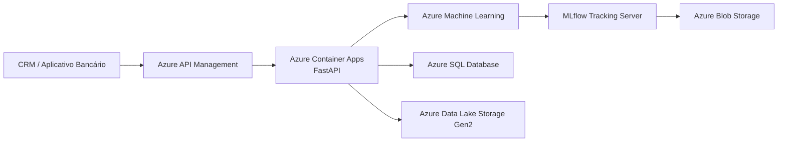

# 🏦 Plataforma de Experimentação Adaptativa com Multi-Armed Bandits

## 📋 Resumo Executivo

Este projeto implementa uma plataforma de recomendação adaptativa baseada no algoritmo **Thompson Sampling (Multi-Armed Bandit)** para selecionar, de forma dinâmica, o canal de comunicação mais adequado em campanhas de marketing bancário.

Como base de experimentação foi utilizado o **Bank Marketing Dataset**, disponível no Kaggle, contendo informações históricas de campanhas de marketing e seus respectivos resultados.

A solução contempla todo o ciclo de **Machine Learning Engineering**, incluindo:

- 📊 Análise exploratória dos dados (EDA);
- 🧹 Preparação e limpeza da base;
- ⚠️ Tratamento de *Data Leakage*;
- 📈 Implementação de uma política Baseline;
- 🤖 Implementação do algoritmo Thompson Sampling;
- 📉 Avaliação utilizando Replay Method;
- 🎯 Validação através de um Golden Set;
- 🌐 Desenvolvimento de uma API REST com FastAPI;
- ☁️ Proposta de arquitetura em Microsoft Azure;
- 📈 Governança e rastreamento dos experimentos utilizando MLflow.

Os resultados demonstraram que a política adaptativa baseada em Thompson Sampling superou a política determinística de referência, obtendo aproximadamente **30% de uplift na taxa de conversão**.

---

## 📊 1. Base Factual e Dicionário de Dados

### Base utilizada

**Bank Marketing Dataset (Kaggle)**

https://www.kaggle.com/datasets/henriqueyamahata/bank-marketing

A base utilizada como referência de contexto de clientes é o **Bank Marketing Dataset**, originário do UCI Machine Learning Repository e disponibilizado publicamente no Kaggle.

O conjunto de dados possui aproximadamente **41.188 registros**, contendo informações relacionadas ao perfil socioeconômico dos clientes e ao resultado de campanhas de marketing bancário.

### Principais atributos utilizados

| Atributo | Descrição |
|----------|-----------|
| `age` | Idade do cliente |
| `job` | Profissão |
| `marital` | Estado civil |
| `education` | Escolaridade |
| `default` | Possui inadimplência |
| `housing` | Possui financiamento imobiliário |
| `loan` | Possui empréstimo pessoal |
| `poutcome` | Resultado da campanha anterior |

---

## 📈 2. Análise Exploratória (EDA) e Preparação da Base

### Variável alvo

A variável alvo original (`y`) representa se o cliente aceitou ou não a oferta de depósito a prazo.

Como a estratégia de Multi-Armed Bandit trabalha com recompensas, essa variável foi convertida para uma coluna numérica denominada **reward**, onde:

- `1` → Conversão
- `0` → Não conversão

A taxa histórica de conversão observada na base foi de **11,26%**, representando:

- 4.640 conversões;
- 36.548 não conversões.


### Distribuição dos dados

Durante a análise exploratória foram observados os seguintes aspectos:

- A maior concentração de clientes encontra-se entre **30 e 45 anos**;
- As variáveis financeiras apresentam forte assimetria positiva;
- O conjunto não possui valores nulos (`NaN`);
- Valores `"unknown"` foram preservados por representarem situações reais de cadastro incompleto;
- Outliers presentes nas variáveis de campanha foram mantidos para preservar o comportamento original dos dados.

### Tratamento de Data Leakage

A coluna **`duration`** foi removida antes do treinamento do modelo.

> **Justificativa:** essa informação somente é conhecida após o encerramento da ligação telefônica. Utilizá-la durante a recomendação configuraria **Data Leakage**, produzindo um modelo inviável para utilização em produção.

---

## 🤖 3. Baseline Determinístico vs. Modelo Adaptativo

Para avaliar o ganho obtido pelo algoritmo adaptativo, foi implementada inicialmente uma **política determinística (Baseline)** e, posteriormente, comparada com uma política baseada em **Thompson Sampling (Multi-Armed Bandit)**.

O problema foi modelado considerando os canais de comunicação como os braços (*arms*) do algoritmo:

| Braço | Canal |
|-------:|--------|
| **0** | Celular (*Cellular*) |
| **1** | Telefone Fixo (*Telephone*) |

### Replay Method

A avaliação foi realizada utilizando o **Replay Method**, técnica amplamente empregada para validar algoritmos de aprendizado online utilizando dados históricos.

Esse método permite simular como o algoritmo teria tomado decisões caso estivesse operando em produção, evitando a necessidade de executar novos experimentos reais.

### Resultados Obtidos

#### Baseline Determinístico

| Métrica | Valor |
|---------|------:|
| Eventos avaliados | **20.539** |
| Taxa média de conversão | **11,1982%** |

#### Thompson Sampling

| Métrica | Valor |
|---------|------:|
| Eventos avaliados | **26.492** |
| Recomendações para Celular | **26.077** |
| Recomendações para Telefone Fixo | **415** |
| Taxa média de conversão | **14,5629%** |
| **Uplift** | **+30,05%** |

### Resultado

O algoritmo Thompson Sampling apresentou desempenho superior ao Baseline, aumentando a taxa média de conversão em aproximadamente **30%**.

Além do ganho observado, o algoritmo reduziu progressivamente sua incerteza estatística, concentrando as recomendações no canal com maior retorno esperado.


---

## 🎯 4. Avaliação e Casos de Teste (Golden Set)

Para validar o comportamento da API e do algoritmo adaptativo foi elaborado um **Golden Set** composto por cinco perfis representativos de clientes.

O objetivo é demonstrar, de forma controlada, como o Thompson Sampling equilibra:

- **Explotação:** prioriza o canal com maior probabilidade de sucesso;
- **Exploração:** ocasionalmente seleciona canais menos utilizados para coletar novas evidências e evitar decisões estáticas.

### Caso 1 — Exploração do melhor canal

```text
ID..............: 100
Idade...........: 54 anos
Profissão.......: services
Estado Civil....: married
Escolaridade....: unknown

Canal recomendado:
→ Celular (Braço 0)

θ Celular........: 0.1486
θ Telefone.......: 0.0288

Justificativa:
A política explorou o canal Celular devido à maior probabilidade estimada de conversão, refletindo o histórico acumulado do algoritmo.
```

### Caso 2 — Exploração do melhor canal

```text
ID..............: 5000
Idade...........: 44 anos
Profissão.......: unknown
Estado Civil....: married
Escolaridade....: basic.6y

Canal recomendado:
→ Celular (Braço 0)

θ Celular........: 0.1445
θ Telefone.......: 0.0239

Justificativa:
A decisão foi baseada no conhecimento acumulado pelo Thompson Sampling, mantendo a política de explotação.
```

### Caso 3 — Exploração do melhor canal

```text
ID..............: 15000
Idade...........: 34 anos
Profissão.......: entrepreneur
Estado Civil....: married
Escolaridade....: professional.course

Canal recomendado:
→ Celular (Braço 0)

θ Celular........: 0.1466
θ Telefone.......: 0.0398

Justificativa:
O canal Celular apresentou maior probabilidade amostrada, refletindo seu melhor desempenho histórico.
```

### Caso 4 — Exploração do melhor canal

```text
ID..............: 25000
Idade...........: 30 anos
Profissão.......: admin.
Estado Civil....: single
Escolaridade....: university.degree

Canal recomendado:
→ Celular (Braço 0)

θ Celular........: 0.1459
θ Telefone.......: 0.0328

Justificativa:
O algoritmo manteve a política de explotação, priorizando o canal de maior retorno esperado.
```

### Caso 5 — Exploração sob incerteza

```text
ID..............: 38000
Idade...........: 39 anos
Profissão.......: self-employed
Estado Civil....: married
Escolaridade....: university.degree

Canal recomendado:
→ Telefone Fixo (Braço 1)

θ Celular........: 0.1345
θ Telefone.......: 0.1352

Justificativa:
Neste caso ocorreu uma decisão de exploração. Apesar do histórico favorecer o canal Celular, a amostragem probabilística do Thompson Sampling selecionou o Telefone Fixo para coletar novas evidências e permitir que o modelo continue aprendendo ao longo do tempo.
```

---

## 🌐 5. API de Recomendação

A solução disponibiliza uma API REST desenvolvida com **FastAPI**, responsável por receber os dados de um cliente e retornar o canal recomendado utilizando o algoritmo **Thompson Sampling**.

### Endpoints disponíveis

| Método | Endpoint | Descrição |
|---------|----------|-----------|
| `GET` | `/` | Verifica se a API está em execução. |
| `GET` | `/health` | Endpoint de monitoramento da aplicação. |
| `POST` | `/recomendar` | Retorna o canal recomendado para o cliente informado. |

### Exemplo de requisição

```json
{
    "client_id": 100,
    "age": 42,
    "job": "technician",
    "marital": "married",
    "education": "university.degree"
}
```

### Exemplo de resposta

```json
{
    "client_id": 100,
    "canal_recomendado": "Celular",
    "score_amostrado": 0.1458,
    "justificativa": "Canal selecionado via Thompson Sampling."
}
```

A API foi desenvolvida para demonstrar como uma plataforma de decisão adaptativa pode recomendar, em tempo real, o canal de maior probabilidade de conversão para cada cliente.

---

# ☁️ 6. Arquitetura-Alvo em Nuvem (Microsoft Azure)

Para uma implantação em ambiente de produção, foi proposta uma arquitetura baseada nos serviços da **Microsoft Azure**, contemplando escalabilidade, observabilidade, governança e rastreabilidade dos experimentos.



## Componentes da Arquitetura

### Azure API Management (APIM)

Gateway responsável por expor e proteger a API de recomendação, aplicando autenticação, autorização, políticas de segurança e controle de consumo (*Rate Limiting*).

---

### Azure Container Apps (ACA)

Serviço responsável por hospedar a aplicação FastAPI, permitindo escalabilidade automática conforme a demanda e simplificando o processo de implantação.

---

### Azure SQL Database

Responsável pelo armazenamento dos dados operacionais da aplicação, como registros de recomendações, histórico de decisões e informações transacionais.

---

### Azure Data Lake Storage Gen2

Armazena dados históricos, conjuntos de treinamento, logs e demais informações analíticas utilizadas durante o ciclo de vida do modelo.

---

### Azure Machine Learning (AML)

Responsável pelo treinamento, monitoramento e gerenciamento do ciclo de vida do modelo de Machine Learning.

Entre suas responsabilidades destacam-se:

- Treinamento dos modelos;
- Monitoramento de desempenho;
- Detecção de *Concept Drift*;
- Avaliações de qualidade e governança;
- Integração com MLflow.

---

### MLflow Tracking Server

Responsável por centralizar os experimentos de Machine Learning, armazenando:

- parâmetros;
- métricas;
- versões dos modelos;
- histórico de execuções;
- comparações entre experimentos.

---

### Azure Blob Storage

Armazena todos os artefatos produzidos durante os experimentos, como:

- modelos treinados;
- gráficos;
- notebooks;
- arquivos auxiliares;
- evidências de treinamento.

Essa arquitetura garante rastreabilidade, reprodutibilidade e facilidade de auditoria dos experimentos realizados.

---

# 📈 7. Ciclo de Vida MLOps e Governança

A solução foi projetada considerando boas práticas de **MLOps**, permitindo rastreabilidade dos experimentos, evolução contínua do modelo e operação em ambiente de produção.

## Rastreamento de Experimentos

Durante o desenvolvimento, os experimentos são registrados localmente utilizando o **MLflow**, armazenando informações em um banco SQLite (`mlflow.db`).

Na arquitetura proposta para produção, o rastreamento passa a utilizar um **MLflow Tracking Server**, responsável por centralizar:

- parâmetros utilizados em cada experimento;
- métricas de avaliação;
- versões dos modelos;
- comparação entre execuções;
- histórico completo de treinamento.

Os artefatos produzidos durante os experimentos são armazenados no **Azure Blob Storage**, garantindo rastreabilidade e reprodutibilidade.

---

## Delayed Rewards (Recompensas Atrasadas)

Em campanhas bancárias, a resposta do cliente normalmente não ocorre imediatamente após o contato.

Por esse motivo, a solução considera um mecanismo de **Delayed Rewards**, permitindo que conversões ocorridas dias após a recomendação sejam incorporadas posteriormente ao algoritmo.

Esse processo possibilita que o Thompson Sampling atualize continuamente seus parâmetros (`α` e `β`) sem necessidade de realizar um novo treinamento completo.

---

## Feedback Loop

A arquitetura prevê um ciclo contínuo de aprendizado:

```text
Cliente
      │
      ▼
Recomendação (API)
      │
      ▼
Contato realizado
      │
      ▼
Conversão (dias depois)
      │
      ▼
Atualização das recompensas
      │
      ▼
Thompson Sampling aprende novamente
```

Dessa forma, a política adaptativa evolui continuamente conforme novos dados são disponibilizados.

---

## Estratégia de Fallback

Caso sejam detectadas anomalias operacionais ou degradação significativa dos indicadores de negócio, a aplicação pode realizar automaticamente um retorno para a política determinística (**Baseline**).

Essa estratégia reduz riscos operacionais enquanto o ambiente é analisado ou um novo modelo é disponibilizado.

---

# 🚀 8. Execução do Projeto

## Instalação das dependências

```bash
pip install -r requirements.txt
```

---

## Inicializando a API

```bash
uvicorn src.app:app --reload --host 127.0.0.1 --port 9000
```

Após iniciar a aplicação, a documentação interativa estará disponível em:

```
http://127.0.0.1:9000/docs
```

---

## Inicializando o MLflow

```bash
mlflow server \
--backend-store-uri sqlite:///mlflow.db \
--host 127.0.0.1 \
--port 5000
```

Interface Web:

```
http://127.0.0.1:5000
```

---

# 📂 Estrutura do Projeto

```text
.
├── data/
│   ├── bank_prepared.csv
│   ├── bank-additional-full.csv
│   └── bank-additional-names.txt
│
├── image/
│   ├── historica.png
│   └── final.png
│
├── notebooks/
│   └── eda_e_preparacao.ipynb
│
├── src/
│   ├── app.py
│   └── mlflow_tracking.py
│
├── mlflow.db
├── requirements.txt
└── README.md
```

---

# ✅ Conclusão

Este projeto apresentou uma solução completa para recomendação adaptativa utilizando **Multi-Armed Bandits** e o algoritmo **Thompson Sampling**.

Além da implementação do algoritmo, foram abordadas todas as etapas normalmente presentes em um projeto de **Machine Learning Engineering**, incluindo preparação dos dados, análise exploratória, validação experimental, disponibilização de uma API para inferência em tempo real, rastreamento de experimentos com MLflow e proposta de arquitetura para implantação em nuvem.

Os resultados obtidos demonstraram que a política adaptativa foi capaz de superar a estratégia determinística utilizada como baseline, alcançando um **uplift aproximado de 30% na taxa de conversão**, evidenciando o potencial da abordagem para aplicações de marketing orientadas por dados.

A arquitetura proposta também permite evolução contínua do modelo, monitoramento dos experimentos e adoção de boas práticas de MLOps, tornando a solução preparada para cenários reais de produção.

---

## 👨‍💻 Autor

Projeto desenvolvido para o **Datathon – Fase 05**, demonstrando a aplicação prática de técnicas de **Machine Learning**, **Online Learning**, **MLOps** e **Arquitetura em Nuvem** na construção de uma plataforma de recomendação adaptativa.