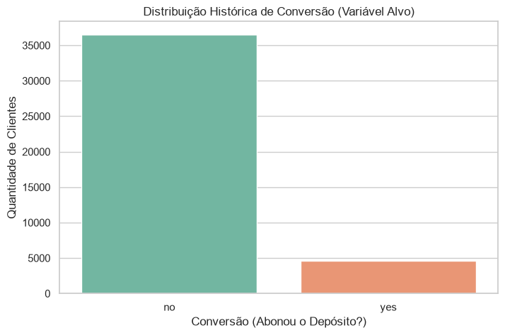
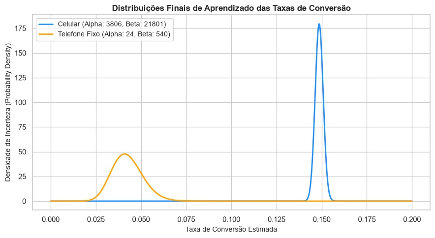
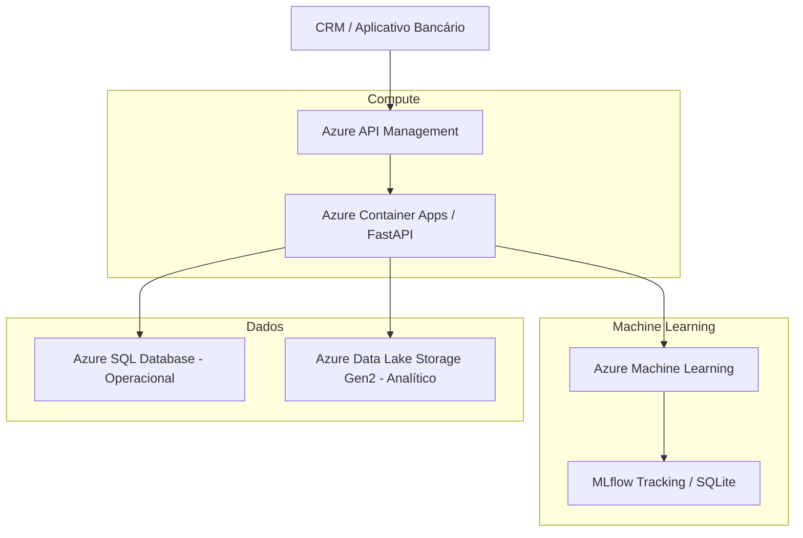

```markdown
# 🏦 Plataforma de Experimentação Adaptativa com Multi-Armed Bandits

Este repositório contém a solução end-to-end desenvolvida para o **Datathon (Fase 05)**[cite: 1]. O objetivo do projeto é implementar e operar uma infraestrutura de experimentação contínua para campanhas de marketing financeiro em canais digitais[cite: 1, 7]. Utilizando algoritmos de aprendizado online (*Online Learning*), a solução substitui regras de negócio engessadas e testes A/B longos por uma abordagem adaptativa baseada em **Thompson Sampling**, maximizando a taxa de conversão e a recompensa acumulada[cite: 1, 7].

---

## 📊 1. Base Factual e Dicionário de Dados

A base utilizada como referência de contexto de clientes é o **Bank Marketing Dataset**, originário do UCI Machine Learning Repository e hospedado publicamente no Kaggle[cite: 1, 8]. O conjunto de dados conta com **41.188 registros** e variáveis que descrevem o perfil socioeconômico e financeiro do cliente[cite: 8].

### Mapeamento de Atributos de Contexto (Vetor de Contexto)[cite: 8, 13]
*   `age`: Idade do cliente (numérico)[cite: 8].
*   `job`: Profissão do cliente (categórico, ex: admin, technician, blue-collar)[cite: 8].
*   `marital`: Estado civil (categórico: married, single, divorced, unknown)[cite: 8].
*   `education`: Nível de escolaridade (categórico)[cite: 8].
*   `default`: Registros de inadimplência ativa de crédito (categórico)[cite: 8].
*   `housing`: Indica se o cliente possui financiamento imobiliário ativo (categórico)[cite: 8].
*   `loan`: Indica se o cliente possui empréstimo pessoal ativo (categórico)[cite: 8].
*   `poutcome`: Resultado da campanha de marketing anterior (categórico: success, failure, unknown)[cite: 8].

---

## 📈 2. Análise Exploratória (EDA) e Preparação da Base

### Análise da Variável Alvo e Taxa de Conversão
A variável alvo original do dataset (`y`) indica se o cliente aceitou ou não a oferta de depósito a prazo[cite: 1, 8]. O cenário apresenta um forte desbalanceamento de classes, registrando **11,26% de taxa de conversão histórica** (4.640 sucessos contra 36.548 falhas)[cite: 14]. Para a modelagem de Bandits, essa variável foi remapeada para a coluna numérica `reward` ($1$ para sucesso/conversão e $0$ para falha)[cite: 4, 13].



### Distribuição de Contexto, Missing Values e Outliers[cite: 6]
*   **Idade e Saldo:** A maior concentração de clientes elegíveis encontra-se na faixa dos 30 aos 45 anos. Variáveis financeiras apresentam forte assimetria positiva, com caldas longas representando clientes de alta renda[cite: 8].
*   **Missing Values:** O dataset não possui valores nulos tradicionais (`NaN`). No entanto, categorias rotuladas como `"unknown"` (em `job`, `education` e `marital`) foram tratadas como dados de contexto válidos, representando cenários reais de incerteza cadastral[cite: 8].
*   **Outliers:** Picos isolados foram encontrados nas variáveis `campaign` (número de contatos realizados) e indicadores macroeconômicos, sendo preservados para simular a fricção real das abordagens[cite: 8].

### Mapeamento de Data Leakage (Vazamento Temporal)[cite: 1, 6]
A coluna `duration` (duração da chamada em segundos) foi **removida obrigatoriamente** do pipeline de preparação da base[cite: 1, 4, 8]. 
> ⚠️ **Justificativa Técnica:** A duração do contato por telefone só é conhecida *depois* que a ação é executada e finalizada[cite: 8]. Utilizá-la no vetor de decisão prévia configuraria *Data Leakage*, invalidando o poder de generalização do modelo adaptativo em produção[cite: 1, 8].

---

## 🤖 3. Baseline Determinístico vs. Modelo Adaptativo

O experimento foi estruturado definindo o canal de comunicação como os braços (*arms*) de decisão do algoritmo[cite: 1, 13]:
*   **Braço 0:** Contato via Celular (*Cellular*)
*   **Braço 1:** Contato via Telefone Fixo (*Telephone*)

### Resultados da Simulação (Replay Method)
Utilizando o *Replay Method* para garantir uma avaliação offline fidedigna a partir dos logs históricos, a política adaptativa do Thompson Sampling superou amplamente o Teste A/B estático[cite: 1, 4]:

*   **Resultados do Baseline Determinístico (A/B Test):**
    *   Eventos avaliados: 20.539 | Taxa Média de Conversão: **11,1982%**[cite: 14]
*   **Resultados do Thompson Sampling (Multi-Armed Bandit):**
    *   Eventos avaliados: 26.492[cite: 14]
    *   Toques no Canal Celular (0): 26.077 vezes | Toques no Canal Telefone Fixo (1): 415 vezes[cite: 14]
    *   Taxa Média de Conversão: **14,5629%**[cite: 14]
    *   🚀 **Ganho de Performance Real (Uplift): +30,05%**[cite: 14]

O gráfico abaixo detalha o aprendizado do modelo. A curva do canal Celular tornou-se estreita e deslocada para a direita, comprovando que o algoritmo reduziu a incerteza e convergiu para o braço de maior retorno comercial[cite: 1].



---

## 🎯 4. Avaliação e Casos de Teste (Golden Set com Diversidade)

O conjunto de testes controlado abaixo valida a maturidade do modelo, comprovando o trade-off prático entre **explotação** (focar no canal de melhor performance) e **exploração** (sorteio estocástico na cauda de incerteza do canal secundário para evitar o congelamento em regras estáticas)[cite: 1, 11].

```text
👤 CASO 1 | ID no Dataset: 100 | Modo: EXPLOTAÇÃO
   Perfil: 54 anos | services | married | education: unknown
   Canal Recomendado: Celular (Braço 0)
   θ Amostrado Celular: 0.1486 | θ Amostrado Fixo: 0.0288
   Justificativa de Engenharia: O modelo explota o Celular (α=3847, β=22232) pois a taxa de conversão acumulada é de longe superior. Para este cliente 'services' de 54 anos, a evidência favorece o canal dominante.

👤 CASO 2 | ID no Dataset: 5000 | Modo: EXPLOTAÇÃO
   Perfil: 44 anos | unknown | married | education: basic.6y
   Canal Recomendado: Celular (Braço 0)
   θ Amostrado Celular: 0.1445 | θ Amostrado Fixo: 0.0239
   Justificativa de Engenharia: Explotação com base no acúmulo de dados estatísticos consistentes e de alta confiança.

👤 CASO 3 | ID no Dataset: 15000 | Modo: EXPLOTAÇÃO
   Perfil: 34 anos | entrepreneur | married | education: professional.course
   Canal Recomendado: Celular (Braço 0)
   θ Amostrado Celular: 0.1466 | θ Amostrado Fixo: 0.0398
   Justificativa de Engenharia: Otimização de conversão direcionada ao canal de maior engajamento do público histórico.

👤 CASO 4 | ID no Dataset: 25000 | Modo: EXPLOTAÇÃO
   Perfil: 30 anos | admin. | single | education: university.degree
   Canal Recomendado: Celular (Braço 0)
   θ Amostrado Celular: 0.1459 | θ Amostrado Fixo: 0.0328
   Justificativa de Engenharia: Escolha de alta confiança orientada pelas distribuições probabilísticas estáveis.

👤 CASO 5 | ID no Dataset: 38000 | Modo: 🔍 EXPLORAÇÃO
   Perfil: 39 anos | self-employed | married | education: university.degree
   Canal Recomendado: Telefone Fixo (Braço 1)
   θ Amostrado Celular: 0.1345 | θ Amostrado Fixo: 0.1352
   Justificativa de Engenharia: EXPLORAÇÃO PONTUAL: Através do sorteio de cauda executado de forma estocástica pelo Thompson Sampling, o canal Telefone Fixo (α=13, β=404) foi selecionado para esta rodada. Essa amostragem sob incerteza é intencional: impede que a plataforma sofra de "cegueira" a mudanças de comportamento da carteira, coletando novas evidências de forma contínua.

```

---

## ☁️ 5. Arquitetura-Alvo em Nuvem (Microsoft Azure)

Para sustentar essa plataforma adaptativa em produção, mitigando custos operacionais e operando com baixa latência, foi desenhada uma arquitetura baseada nos serviços de nuvem da **Microsoft Azure**:



### Componentes de Infraestrutura


1. **Azure API Management (APIM):** Gateway central de entrada que protege as APIs, gerencia o controle de acessos e aplica políticas de *rate limiting* para os canais consumidores (CRM ou apps de canais).


2. **Azure Container Apps (ACA):** Camada serverless encarregada de hospedar e executar o serviço de decisão em tempo real construído com **FastAPI**, garantindo escalabilidade automática horizontal e deploy simplificado.


3. **Azure SQL Database & Data Lake Storage Gen2:** O Azure SQL armazena os estados transacionais e operacionais imediatos das ações recomendadas. O Data Lake Gen2 centraliza os dados analíticos históricos, logs brutos e artefatos de treinamento para auditoria.


4. **Azure Machine Learning (AML) & Model Registry:** Provê o ambiente para o monitoramento de *concept drift*, avaliações de injustiça (*fairness*) e tracking completo do ciclo de vida dos Bandits.


---

## 📈 6. Ciclo de Vida MLOps e Governança

* **Rastreabilidade Local (MLflow):** Parâmetros analíticos ($Alpha$ e $Beta$) e métricas consolidadas de conversão e *uplift* são registrados em um banco relacional SQLite imutável (`mlflow.db`), garantindo a reprodutibilidade dos experimentos.


* **Tratamento de Recompensas Atrasadas (*Delayed Rewards*):** Em campanhas financeiras reais, a resposta do cliente ocorre de forma assíncrona (atrasos de dias entre o envio da mensagem e o depósito em conta). A plataforma utiliza uma arquitetura de *Feedback Loop*, consolidando conversões tardias de forma diária para re-calibrar os priors sem necessidade de novos deploys de código.


* **Plano de Fallback e Emergência:** Caso anomalias de negócio ou quedas drásticas de ROI sejam detectadas em produção por alertas de observabilidade, a API realiza o *rollback* imediato para a **Política Determinística (Baseline)**, ancorando as ofertas em regras conservadoras fixas até o restabelecimento do sistema.


---

## 🚀 Instruções de Execução Local

### 1. Inicializar a API de Recomendação (FastAPI)

```bash
uvicorn src.app:app --reload --host 127.0.0.1 --port 9000

```

Acesse o Swagger interativo em `http://127.0.0.1:9000/docs` para disparar payloads via POST e validar o retorno em milissegundos.

### 2. Inicializar o Servidor de Governança (MLflow)

```bash
mlflow server --backend-store-uri sqlite:///mlflow.db --host 127.0.0.1 --port 5000

```

