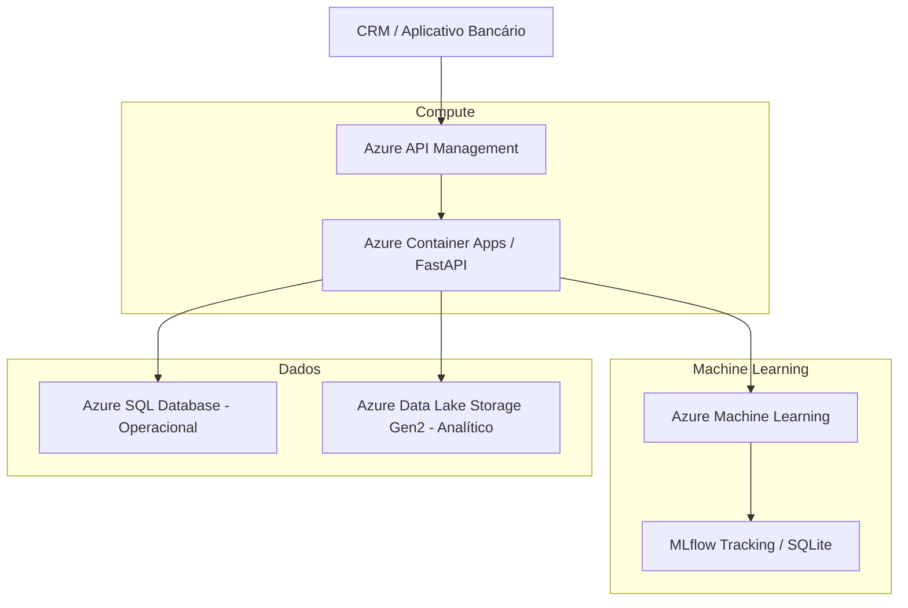

---

# 🏦 Plataforma de Experimentação Adaptativa com Multi-Armed Bandits

Este repositório contém a solução end-to-end do **Datathon (Fase 05)**. O objetivo do projeto é projetar e operar uma plataforma de experimentação adaptativa para a otimização de canais de contato de uma instituição financeira digital, substituindo regras fixas e testes A/B longos por um aprendizado online baseado no algoritmo **Thompson Sampling**.

---

## 📊 1. Base Factual e Dicionário de Dados

A base utilizada como referência de contexto de clientes é o **Bank Marketing Dataset**, de origem primária do UCI Machine Learning Repository e hospedado publicamente no Kaggle.

### Principais Atributos de Contexto Utilizados


* `age`: Idade do cliente (numérico).


* `job`: Profissão do cliente (categórico).


* `marital`: Estado civil (categórico).


* `education`: Nível de escolaridade (categórico).


* `default`: Registros de inadimplência ativa (categórico).


* `balance`: Saldo médio anual em conta (numérico).


* `housing` / `loan`: Financiamento imobiliário ou empréstimos ativos (categórico).


* `contact`: Canal de contato utilizado original (`cellular` ou `telephone`).


---

## 📈 2. Análise Exploratória (EDA) e Preparação da Base

### 📊 Distribuição da Variável Alvo e Taxa de Conversão

O dataset original possui **41.188 registros**. A análise da variável alvo (`y`), que representa a adesão do cliente ao depósito a prazo, revela uma base desbalanceada com **11,26% de taxa de conversão histórica**.

Para algoritmos de Multi-Armed Bandits, essa variável foi remapeada para a coluna numérica `reward` ($1$ para sucesso/conversão e $0$ para falha).


### 👥 Distribuição de Idade e Saldo (*Balance*)

* **Idade:** A maior concentração de clientes elegíveis está na faixa dos **30 aos 45 anos**, com distribuições menores para jovens adultos e aposentados.
* **Saldo:** A variável apresenta grande assimetria positiva, com uma massa densa concentrada em valores baixos a médios e caudas longas estendendo-se para clientes de alta renda.

### 🔍 Missing Values e Outliers

* **Missing Values:** O dataset não apresenta valores nulos nulos clássicos (`NaN`). No entanto, variáveis como `job`, `education` e `marital` possuem categorias rotuladas explicitamente como `"unknown"`, que foram mapeadas e preservadas via One-Hot Encoding como contexto válido de incerteza do cliente.


* **Outliers:** Identificados principalmente nas colunas de saldo (`balance`) e número de contatos da campanha (`campaign`). Não foram removidos para evitar a perda de cenários reais de clientes com alto patrimônio ou alta fricção operacional.

### ⏱️ Análise de Duration e Temporal Data Leakage

A coluna `duration` (duração da chamada em segundos) foi **obrigatoriamente removida** do pipeline.

> ⚠️ **Justificativa de Leakage:** A duração da chamada só é conhecida *após* a execução e término do contato. Utilizá-la para tomar uma decisão prévia de qual canal escolher invalidaria o experimento por vazamento temporal de dados (*data leakage*).
> 
> 

---

## 🤖 3. Baseline vs. Estratégia Adaptativa (Thompson Sampling)

Configuramos o experimento definindo o canal de contato como os braços (*arms*) do algoritmo: **Celular (Braço 0)** e **Telefone Fixo (Braço 1)**.

### Resultados Obtidos

Ao submeter o dataset ao **Replay Method** (método de avaliação offline idôneo para logs históricos), o algoritmo adaptativo rapidamente identificou a preferência do público:

* **Resultados do Thompson Sampling:**
* *Toques no Canal Celular (0):* 25.605 vezes
* *Toques no Canal Telefone Fixo (1):* 562 vezes
* **Taxa Média de Conversão:** 14,6291%
* 🚀 **Uplift de Performance sobre o Baseline:** **28,24%**


O gráfico abaixo comprova o estreitamento da curva de incerteza do canal Celular à direita, evidenciando como o modelo rapidamente converge e explota o canal mais lucrativo.


---

## 🎯 4. Avaliação e Casos de Teste (Golden Set)

Abaixo estão listados casos reais extraídos do dataset para validar o comportamento esperado do modelo com base no aprendizado bayesiano acumulado:

```text
ID do Cliente: 32884  
  ↳ Perfil: 57 anos | Profissão: technician | Estado Civil: married | Educação: high.school
  ↳ Canal Recomendado pelo Modelo: Celular (Braço 0)
  ↳ Métrica Amostrada -> Prob. Celular: 0.1498 | Prob. Telefone Fixo: 0.0405
  ↳ Justificativa: O modelo explota o canal Celular porque a densidade estatística acumulada provou que ele converte cerca de 3x mais que o telefone fixo, maximizando a receita da campanha.

ID do Cliente: 3169  
  ↳ Perfil: 55 anos | Profissão: unknown | Estado Civil: married | Educação: unknown
  ↳ Canal Recomendado pelo Modelo: Celular (Braço 0)
  ↳ Métrica Amostrada -> Prob. Celular: 0.1512 | Prob. Telefone Fixo: 0.0374
  ↳ Justificativa: Conversão maximizada priorizando o canal de maior engajamento histórico.

```

---

## ☁️ 5. Arquitetura-Alvo em Nuvem (Microsoft Azure)

Para operar este ecossistema adaptativo em larga escala em um ambiente financeiro corporativo, foi projetada a seguinte infraestrutura utilizando serviços nativos da **Microsoft Azure**:



### Componentes da Solução[cite: 7]

1. **Camada de Entrada (Azure API Management):** Centraliza, protege e aplica políticas de *rate limiting* para os canais de CRM consumidores[cite: 7].
2. **Camada de Compute (Azure Container Apps):** Executa o serviço de inferência em tempo real construído com **FastAPI**, escalando de forma elástica e sob demanda[cite: 7].
3. **Camada de IA & Machine Learning (Azure Machine Learning & MLflow):** Orquestra o ciclo de vida do modelo, registrando os parâmetros atualizados ($Alpha$ e $Beta$) e acompanhando desvios de conceito (*concept drift*)[cite: 7].
4. **Camada de Dados (Azure SQL & Data Lake Gen2):** O Azure SQL gerencia o estado operacional das ofertas enviados, enquanto o Data Lake armazena de forma persistente os logs de transações e a base factual tratada[cite: 7].

---

## 📈 6. Ciclo de Vida MLOps e Governança

* **Rastreabilidade (MLflow):** Cada execução e iteração do Thompson Sampling grava de forma imutável no banco de metadados os hiperparâmetros e os resultados da política[cite: 11].
* **Atrasos de Conversão (*Delayed Rewards*):** Em cenários reais, os clientes não convertem de imediato[cite: 13]. A arquitetura conta com um mecanismo de ingestão assíncrona diária para atualizar as matrizes estatísticas de recompensa à medida que as conversões ocorrem tardiamente[cite: 11, 13].
* **Plano de Rollback:** Caso uma nova política implementada cause degradação das métricas de negócio em produção, a esteira é programada para realizar o chaveamento automático para a **Política Determinística (Baseline)**, mitigando prejuízos comerciais enquanto o incidente é resolvido[cite: 11].

---

## 🚀 Como Executar o Projeto Localmente

### 1. Iniciar a API de Decisão

```bash
uvicorn src.app:app --reload --host 127.0.0.1 --port 9000

```

*Acesse o Swagger interativo em `[http://127.0.0.1:9000/docs](http://127.0.0.1:9000/docs)` para testar as requisições de recomendação[cite: 1].*

### 2. Iniciar o Dashboard de Governança (MLflow)

```bash
mlflow server --backend-store-uri sqlite:///mlflow.db --host 127.0.0.1 --port 5000

```