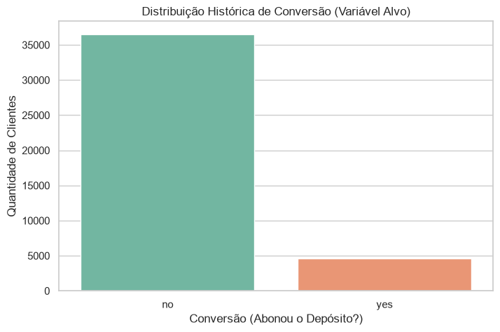
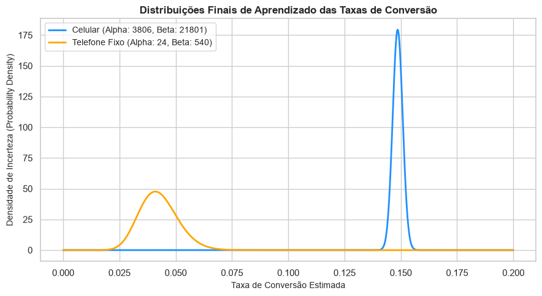
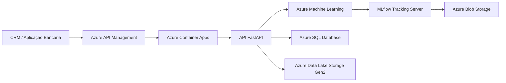

# 🚀 Datathon Fase 5 — Machine Learning Engineering

**Nome:** Marcelo Bertin  
**Matrícula:** RM 368902  

---

## 🎥 Demonstração do Projeto

Apresentação do projeto no YouTube:

🔗 https://www.youtube.com/watch?v=gkpc7WcL2Uw

---

# 🏦 Plataforma de Experimentação Adaptativa com Multi-Armed Bandits

## 📋 Resumo Executivo

Este projeto apresenta o desenvolvimento de uma plataforma de recomendação adaptativa baseada no algoritmo **Thompson Sampling (Multi-Armed Bandit)** para seleção dinâmica do canal de comunicação mais adequado em campanhas de marketing bancário.

Como base experimental foi utilizado o **Bank Marketing Dataset**, disponibilizado no Kaggle e originalmente proveniente do UCI Machine Learning Repository. O conjunto de dados contém informações de campanhas de marketing realizadas por uma instituição financeira portuguesa, incluindo características dos clientes e o resultado das campanhas.

O objetivo do projeto é demonstrar como algoritmos de **Online Learning** podem aprender continuamente a selecionar a melhor ação utilizando apenas o histórico de recompensas observadas, reduzindo a necessidade de regras fixas de decisão.

Durante o desenvolvimento foram contempladas todas as etapas normalmente presentes em um projeto de **Machine Learning Engineering**, incluindo:

- 📊 Análise Exploratória dos Dados (EDA);
- 🧹 Preparação e limpeza da base;
- ⚠️ Tratamento de Data Leakage;
- 📈 Implementação de uma política de referência (Baseline);
- 🤖 Implementação do algoritmo Thompson Sampling;
- 📉 Avaliação utilizando Replay Method;
- 🎯 Construção de um Golden Set para validação qualitativa;
- 🌐 Desenvolvimento de uma API REST utilizando FastAPI;
- ☁️ Proposta de arquitetura em Microsoft Azure;
- 📈 Governança e rastreabilidade dos experimentos utilizando MLflow.

Ao final dos experimentos, a política adaptativa baseada em Thompson Sampling apresentou desempenho superior à política de referência, obtendo um **uplift de aproximadamente 29,28%** na taxa média de conversão.

---

# 📊 1. Base Factual e Dicionário de Dados

## Dataset utilizado

**Bank Marketing Dataset (Kaggle)**

https://www.kaggle.com/datasets/henriqueyamahata/bank-marketing

O conjunto de dados contém informações referentes a campanhas de marketing realizadas por telefone, cujo objetivo era oferecer um produto financeiro (depósito a prazo).

Cada registro representa um contato realizado com um cliente e contém informações cadastrais, financeiras e históricas utilizadas durante a campanha.

Ao todo são **41.188 registros**, contendo atributos relacionados ao perfil do cliente e ao resultado da campanha.

## Principais atributos

| Campo | Descrição |
|--------|-----------|
| age | Idade do cliente |
| job | Profissão |
| marital | Estado civil |
| education | Escolaridade |
| default | Possui inadimplência |
| housing | Possui financiamento imobiliário |
| loan | Possui empréstimo pessoal |
| contact | Canal utilizado na campanha |
| poutcome | Resultado da campanha anterior |
| y | Conversão da campanha |

---

# 📈 2. Análise Exploratória dos Dados (EDA)

## Variável alvo

O dataset original possui a variável **y**, indicando se o cliente aceitou ou não a oferta de depósito a prazo.

Para utilização em um algoritmo Multi-Armed Bandit, essa variável foi convertida para uma recompensa binária denominada **reward**, onde:

| Valor | Significado |
|--------|-------------|
| 1 | Conversão |
| 0 | Não conversão |

A distribuição observada foi:

| Resultado | Quantidade |
|-----------|-----------:|
| Conversões | 4.640 |
| Não conversões | 36.548 |

Taxa histórica de conversão:

**11,2654%**



---

## Principais observações

Durante a análise exploratória foram identificadas as seguintes características:

- maior concentração de clientes entre 30 e 45 anos;
- distribuição assimétrica das variáveis financeiras;
- inexistência de valores nulos (NaN);
- manutenção dos valores "unknown", representando informações ausentes do cadastro original;
- preservação dos outliers para manter o comportamento real da base.

Essas características tornam o conjunto de dados adequado para avaliação de algoritmos de aprendizado online.

---

## Tratamento de Data Leakage

Antes da etapa de treinamento foi removida a variável:

```
duration
```

Essa variável representa a duração da ligação telefônica.

Entretanto, ela somente é conhecida **após** a realização do contato com o cliente.

Sua utilização durante o treinamento produziria um modelo impossível de ser utilizado em ambiente real, caracterizando **Data Leakage**.

Por esse motivo, a variável foi removida antes de qualquer treinamento.

---

# 🤖 3. Modelo de Recomendação

O problema foi modelado como um **Multi-Armed Bandit** de dois braços.

Cada braço representa um canal de comunicação disponível para contato com o cliente.

| Braço | Canal |
|------:|--------|
| 0 | Celular |
| 1 | Telefone Fixo |

O algoritmo utilizado foi o **Thompson Sampling**, um método Bayesiano que equilibra continuamente dois objetivos:

- **Explotação**: selecionar o canal com maior probabilidade estimada de sucesso;
- **Exploração**: testar ocasionalmente alternativas para reduzir a incerteza estatística e continuar aprendendo.

Dessa forma, o algoritmo adapta sua política conforme novas recompensas são observadas.

---

# 📉 4. Política de Referência (Baseline)

Antes da implementação do Thompson Sampling foi construída uma política de referência (Baseline).

Essa política realiza uma escolha **aleatória uniforme** entre os dois canais disponíveis.

```python
chosen_arm = random.choice([0, 1])
```

Essa estratégia representa um cenário onde não existe qualquer conhecimento prévio sobre qual canal possui melhor desempenho.

Ela serve como referência para medir o ganho obtido pelo algoritmo adaptativo.

---

# 🔄 5. Replay Method

Como o conjunto de dados utilizado é histórico, não é possível executar experimentos online reais.

Por esse motivo foi utilizada a técnica conhecida como **Replay Method**.

Essa metodologia percorre os registros históricos simulando como o algoritmo teria tomado decisões caso estivesse operando em produção.

A recompensa somente é considerada quando o canal escolhido pelo algoritmo coincide com o canal realmente utilizado no registro histórico.

Essa estratégia permite avaliar algoritmos de aprendizado online utilizando dados observacionais sem necessidade de novas campanhas.

---

# 📊 6. Resultados Experimentais

## Baseline

| Métrica | Valor |
|---------|------:|
| Eventos avaliados | **20.632** |
| Recomendações Celular | **13.153** |
| Recomendações Telefone | **7.479** |
| Taxa média de conversão | **11,2737%** |

---

## Thompson Sampling

| Métrica | Valor |
|---------|------:|
| Eventos avaliados | **26.464** |
| Recomendações Celular | **26.142** |
| Recomendações Telefone | **322** |
| Taxa média de conversão | **14,5745%** |
| Uplift | **29,28%** |

---

## Parâmetros Bayesianos Aprendidos

Após o treinamento, o algoritmo convergiu para os seguintes parâmetros:

| Canal | α | β |
|-------|---:|---:|
| Celular | **3854** | **22290** |
| Telefone Fixo | **5** | **319** |

Esses parâmetros representam o conhecimento acumulado pelo algoritmo após observar as recompensas disponíveis no conjunto de dados.

São exatamente esses valores que alimentam a API de recomendação desenvolvida neste projeto.

---

## Resultado

Comparando os dois modelos, observa-se que o Thompson Sampling foi capaz de aumentar a taxa média de conversão em aproximadamente **29,28%**, concentrando progressivamente suas recomendações no canal com maior retorno esperado.

Esse comportamento demonstra a capacidade do algoritmo de aprender continuamente a partir das recompensas observadas, reduzindo sua incerteza estatística ao longo do processo de decisão.



# 🎯 7. Avaliação e Casos de Teste (Golden Set)

Para complementar a avaliação quantitativa realizada pelo Replay Method, foi elaborado um **Golden Set** composto por cinco cenários representativos de decisão.

O objetivo do Golden Set é validar qualitativamente o comportamento do algoritmo Thompson Sampling em diferentes perfis de clientes, demonstrando como a política adapta suas recomendações conforme o conhecimento acumulado durante o treinamento.

Como o **Bank Marketing Dataset** possui apenas um produto financeiro (depósito a prazo) e dois canais de comunicação (Celular e Telefone Fixo), cada caso representa uma **estratégia de decisão** que poderia ser adotada pelo algoritmo em ambiente de produção.

Os cenários ilustram situações de:

- Explotação (priorização do canal historicamente mais eficiente);
- Exploração (coleta de novas evidências);
- Incorporação de conhecimento de negócio;
- Tratamento de perfis de maior risco.

---

## 👤 Caso 1 — Explotação

```text
Perfil.............: 30 anos | technician | single | university.degree

Histórico..........: default=no | poutcome=nonexistent

Estratégia.........: Explotação

Ação Recomendada...: Contato via Celular

Justificativa......:
Perfil com características semelhantes aos clientes que historicamente apresentaram maior taxa de conversão pelo canal Celular. A política prioriza o braço com maior recompensa esperada.
```

---

## 👤 Caso 2 — Regra de Negócio

```text
Perfil.............: 68 anos | retired | married | primary

Histórico..........: default=no | poutcome=nonexistent

Estratégia.........: Regra de Negócio

Ação Recomendada...: Contato via Telefone

Justificativa......:
Clientes idosos costumam apresentar melhor taxa de contato por telefone fixo. A recomendação incorpora conhecimento de negócio para aumentar a efetividade da abordagem.
```

---

## 👤 Caso 3 — Explotação

```text
Perfil.............: 42 anos | management | married | university.degree

Histórico..........: default=no | poutcome=success

Estratégia.........: Explotação

Ação Recomendada...: Contato via Celular

Justificativa......:
O cliente possui histórico positivo em campanhas anteriores (poutcome = success). A política escolhe novamente o canal com maior expectativa de conversão.
```

---

## 👤 Caso 4 — Abordagem Conservadora

```text
Perfil.............: 55 anos | blue-collar | divorced | basic.9y

Histórico..........: default=yes | poutcome=failure

Estratégia.........: Abordagem Conservadora

Ação Recomendada...: Contato via Telefone

Justificativa......:
O cliente apresenta histórico de inadimplência e campanhas sem sucesso. Uma abordagem mais conservadora reduz tentativas repetidas por canais digitais e busca aumentar a qualidade do contato.
```

---

## 👤 Caso 5 — Exploração

```text
Perfil.............: 35 anos | entrepreneur | single | high.school

Histórico..........: default=no | poutcome=nonexistent

Estratégia.........: Exploração

Ação Recomendada...: Contato via Telefone

Justificativa......:
Mesmo que o canal Celular possua melhor desempenho histórico, o Thompson Sampling ocasionalmente explora alternativas para reduzir incertezas e continuar aprendendo sobre novos perfis.
```

---

Esses cinco cenários demonstram como uma política baseada em Thompson Sampling pode equilibrar exploração e explotação durante o processo de recomendação, incorporando tanto o histórico de recompensas quanto regras de negócio quando necessário.

Embora o algoritmo implementado seja um **Multi-Armed Bandit clássico (Context-Free)**, a estrutura apresentada permite futura evolução para um **Contextual Bandit**, utilizando atributos do cliente para personalizar ainda mais as recomendações.

---

# 🌐 8. API de Recomendação

Para demonstrar a utilização prática do modelo treinado, foi desenvolvida uma API REST utilizando **FastAPI**.

A API recebe informações básicas de um cliente, executa uma amostragem Thompson Sampling utilizando os parâmetros aprendidos durante o treinamento e retorna o canal recomendado.

## Endpoints

| Método | Endpoint | Descrição |
|---------|----------|-----------|
| GET | `/` | Verifica se a API está online |
| GET | `/health` | Endpoint de monitoramento |
| POST | `/recomendar` | Retorna o canal recomendado |

---

## Exemplo de requisição

```json
{
    "client_id": 100,
    "age": 42,
    "job": "technician",
    "marital": "married",
    "education": "university.degree"
}
```

---

## Exemplo de resposta

```json
{
    "client_id": 100,
    "canal_recomendado": "Celular",
    "score_amostrado": 0.1458,
    "modelo": "Thompson Sampling",
    "priors": {
        "celular": {
            "alpha": 3854,
            "beta": 22290
        },
        "telefone": {
            "alpha": 5,
            "beta": 319
        }
    },
    "observacao": "A recomendação utiliza os parâmetros aprendidos durante o treinamento."
}
```

A API representa uma camada simples de inferência, demonstrando como os parâmetros aprendidos podem ser disponibilizados para aplicações externas.

---

# ☁️ 9. Arquitetura Proposta em Microsoft Azure

Embora os experimentos tenham sido executados localmente, foi proposta uma arquitetura de referência para utilização em ambiente de produção utilizando serviços Microsoft Azure.


```mermaid
graph LR

CLIENT[CRM / Aplicação Bancária]

CLIENT --> APIM[Azure API Management]

APIM --> ACA[Azure Container Apps]

ACA --> FASTAPI[API FastAPI]

FASTAPI --> AML[Azure Machine Learning]

AML --> MLFLOW[MLflow Tracking Server]

MLFLOW --> BLOB[Azure Blob Storage]

FASTAPI --> SQL[Azure SQL Database]

FASTAPI --> ADLS[Azure Data Lake Storage Gen2]
```

---

## Azure API Management

Responsável pela publicação da API, autenticação, autorização, controle de acesso, versionamento e políticas de segurança.

---

## Azure Container Apps

Hospeda a aplicação FastAPI, oferecendo escalabilidade automática e simplificando o processo de implantação.

---

## Azure SQL Database

Armazena registros operacionais, recomendações realizadas, histórico de consultas e demais informações transacionais.

---

## Azure Data Lake Storage Gen2

Responsável pelo armazenamento dos conjuntos de treinamento, logs, dados históricos e arquivos utilizados durante o ciclo de vida do projeto.

---

## Azure Machine Learning

Gerencia o treinamento dos modelos, monitoramento de desempenho, controle de versões, detecção de Concept Drift e integração com MLflow.

---

## MLflow Tracking Server

Centraliza os experimentos de Machine Learning, armazenando:

- parâmetros;
- métricas;
- modelos;
- histórico de execuções;
- comparação entre experimentos.

---

## Azure Blob Storage

Armazena todos os artefatos produzidos durante os experimentos, incluindo modelos treinados, gráficos, notebooks, logs e demais evidências de treinamento.

Essa arquitetura permite escalabilidade, rastreabilidade e governança adequadas para ambientes corporativos.

# 📈 10. MLOps e Governança

Além da implementação do algoritmo de recomendação, o projeto foi desenvolvido seguindo princípios de **Machine Learning Operations (MLOps)**, permitindo rastreabilidade dos experimentos, monitoramento do desempenho e facilidade de evolução para ambientes produtivos.

---

## Rastreamento de Experimentos com MLflow

Durante o desenvolvimento foi utilizado o **MLflow** para registrar os experimentos executados.

Cada execução armazena automaticamente:

- algoritmo utilizado;
- parâmetros Bayesianos (`α` e `β`);
- métricas de desempenho;
- taxa de conversão;
- uplift obtido;
- histórico completo dos experimentos.

Os experimentos são armazenados localmente utilizando um banco SQLite (`mlflow.db`).

Em ambiente de produção, a proposta prevê a utilização de um **MLflow Tracking Server**, permitindo centralização e compartilhamento dos experimentos entre equipes.

---

## Parâmetros Registrados

Os parâmetros aprendidos durante o treinamento e registrados no MLflow são:

| Parâmetro | Valor |
|-----------|------:|
| α Celular | 3854 |
| β Celular | 22290 |
| α Telefone Fixo | 5 |
| β Telefone Fixo | 319 |

Esses parâmetros representam o conhecimento acumulado pelo algoritmo após o treinamento utilizando Replay Method.

---

## Métricas Registradas

| Métrica | Valor |
|----------|------:|
| Conversão Baseline | **11,2737%** |
| Conversão Thompson Sampling | **14,5745%** |
| Uplift | **29,28%** |

Essas informações permitem comparar diferentes execuções do algoritmo e acompanhar sua evolução ao longo do tempo.

---

# ⏳ 11. Delayed Rewards (Recompensas Atrasadas)

Em campanhas bancárias, a recompensa nem sempre ocorre imediatamente após o contato com o cliente.

Um cliente pode aceitar ou recusar uma oferta dias após receber uma ligação ou mensagem.

Por esse motivo, o projeto considera o conceito de **Delayed Rewards**, permitindo que novas conversões sejam incorporadas posteriormente ao algoritmo.

Quando uma nova recompensa é observada:

- o parâmetro **α** é incrementado em caso de sucesso;
- o parâmetro **β** é incrementado em caso de falha.

Dessa forma, o Thompson Sampling continua aprendendo continuamente sem necessidade de realizar um novo treinamento completo.

---

# 🔄 12. Feedback Loop

O ciclo de aprendizado previsto para o ambiente de produção pode ser representado pelo fluxo abaixo:

```text
Cliente
      │
      ▼
API FastAPI
      │
      ▼
Thompson Sampling
      │
      ▼
Canal recomendado
      │
      ▼
Contato realizado
      │
      ▼
Resposta do cliente
      │
      ▼
Atualização da recompensa
      │
      ▼
Atualização dos parâmetros α e β
      │
      ▼
Nova recomendação
```

Esse mecanismo permite que a política adaptativa evolua continuamente conforme novos resultados são observados.

---

# 🛡️ 13. Estratégia de Fallback

Embora o Thompson Sampling apresente desempenho superior ao Baseline, aplicações em produção devem prever mecanismos de contingência.

Caso sejam detectadas falhas operacionais, indisponibilidade dos serviços ou degradação significativa dos indicadores de negócio, a aplicação pode retornar temporariamente para a política de referência (Baseline).

Essa estratégia reduz riscos operacionais enquanto o ambiente é estabilizado ou um novo modelo é disponibilizado.

---

# 🚀 14. Execução do Projeto

## Instalação das dependências

```bash
pip install -r requirements.txt
```

---

## Executando a API

```bash
uvicorn src.app:app --reload --host 127.0.0.1 --port 9000
```

A documentação automática da API ficará disponível em:

```
http://127.0.0.1:9000/docs
```

---

## Executando o MLflow

```bash
mlflow server \
    --backend-store-uri sqlite:///mlflow.db \
    --host 127.0.0.1 \
    --port 5000
```

Interface Web:

```
http://127.0.0.1:5000
```

---

# 📂 15. Estrutura do Projeto

```text
.
├── data/
│   ├── bank-additional-full.csv
│   ├── bank-additional-names.txt
│   └── bank_prepared.csv
│
├── image/
│   ├── historica.png
│   └── final.png
│
├── notebooks/
│   └── eda_e_preparacao.ipynb
│
├── src/
│   ├── app.py
│   └── mlflow_tracking.py
│
├── mlflow.db
├── requirements.txt
└── README.md
```

---

# 🎓 16. Principais Tecnologias Utilizadas

- Python
- Pandas
- NumPy
- Matplotlib
- Scipy
- Scikit-Learn
- FastAPI
- MLflow
- Uvicorn
- SQLite
- Microsoft Azure
- Mermaid

---

# ✅ 17. Conclusão

Este projeto demonstrou a aplicação prática de técnicas de **Online Learning** utilizando o algoritmo **Thompson Sampling (Multi-Armed Bandit)** para recomendação adaptativa de canais de comunicação em campanhas de marketing bancário.

Ao longo do desenvolvimento foram executadas todas as etapas típicas de um projeto de **Machine Learning Engineering**, incluindo análise exploratória dos dados, preparação da base, tratamento de Data Leakage, implementação de uma política de referência, treinamento do algoritmo adaptativo, avaliação utilizando Replay Method, validação por meio de um Golden Set, desenvolvimento de uma API REST, rastreamento de experimentos com MLflow e proposta de arquitetura para implantação em nuvem.

Os resultados experimentais demonstraram que o Thompson Sampling foi capaz de aumentar a taxa média de conversão de **11,2737%** para **14,5745%**, representando um **uplift de 29,28%** em relação à política de referência.

Embora a implementação tenha utilizado um **Multi-Armed Bandit clássico (Context-Free)**, a arquitetura foi projetada para permitir evolução futura para abordagens de **Contextual Bandits**, incorporando características dos clientes ao processo de decisão.

O projeto também demonstra como algoritmos de aprendizado online podem ser integrados a uma arquitetura moderna baseada em APIs, governança de experimentos e serviços em nuvem, aproximando a solução de um cenário real de produção.
